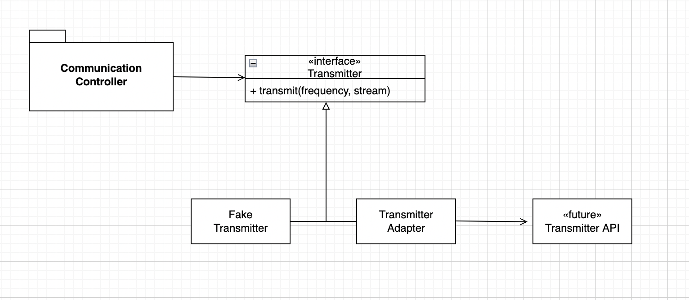

# 경계
시스템에 들어가는 모든 소프트웨어를 직접 개발하는 경우는 드물다. 어떤 식으로든 외부 코드를 우리 코드에 깔끔하게 통합해야만 한다. 소프트웨어 경계를 깔끔하게 처리하는 기법과 기교를 살펴보자.

## 외부 코드 사용하기
- java.util.Map은 굉장히 다양한 인터페이스로 수많은 기능을 제공한다. Map이 제공하는 기능성과 유연성은 확실히 유용하지만 그만큼 위험도 크다.
- 우선, Map 사용자라면 누구나 Map 내용을 clear()로 지울 수 있다. 또 Map은 객체 유형도 제한하지 않는다. 그러므로 Map이 반환하는 Object를 올바른 유형으로 변환할 책임은 Map을 사용하는 클라이언트에 있다. 그래도 코드는 동작한다. 그러나 깨끗한 코드라 보기 어렵다. 게다가 의도도 분명히 드러나지 않는다.
- 대신 Generics를 사용하면 코드 가독성이 크게 높아진다. 그러나 Generics 역시 사용자에게 필요하지 않은 기능까지 제공한다는 문제가 있다. Map 인터페이스가 변할 경우, 수정할 코드가 상당히 많아진다.
```java
public class Sensors {
    private Map sensors = new HashMap();

    public Sensor getById(String id) {
        return (Sensor) sensors.get(id);
    }
}
```
- 위의 코드는 Map을 좀 더 깔끔하게 사용한 코드다. 경계 인터페이스인 Map을 Sensors 안으로 숨긴다. 따라서 Map 인터페이스가 변하더라도 나머지 프로그램에는 영향을 미치지 않는다. 제네릭스를 사용하든 하지 않든 더 이상 문제가 안된다. Sensors 클래스 안에서 객체 유형을 관리하고 변환하기 때문이다.
- 또한, Sensors 클래스는 프로그램에 필요한 인터페이스만 제공한다. 그래서 코드는 이해하기는 쉽지만 오용하기는 어렵다. Sensors 클래스는 나머지 프로그램이 설계 규칙과 비즈니스 규칙을 따르도록 강제할 수 있다.
- Map 클래스를 사용할 때마다 위와 같이 캡슐화하라는 소리가 아니다. Map 혹은 유사한 경계 인터페이스를 여기저기 넘기지 말라는 말이다. Map 인터페이스를 공개 API의 인수로 넘기거나 반환값으로 사용하지 않는다.

## 경계 살피고 익히기
- 외부 코드를 사용하면 적은 시간에 더 많은 기능을 출시하기 쉬워진다. 그러나 외부 코드를 익히기 어렵고, 외부 코드를 통합하기도 어렵다. 학습 테스트라는 것을 통해서 외부 코드를 익히자.

### 학습 테스트
- 학습 테스트는 곧바로 우리쪽 코드를 작성해 외부 코드를 호출하는 대신 먼저 간단한 테스트 케이스를 작성해 외부 코드를 익히는 것이다.
- 프로그램에서 사용하려는 방식대로 외부 API를 호출한다. 통제된 환경에서 API를 제대로 이해하는지를 확인하는 셈이다. 학습 테스트는 API를 사용하려는 목적에 초점을 맞춘다.

## log4j 익히기

## 학습 테스트는 공짜 이상이다.
- 학습 테스트는 필요한 지식만 확보하는 쉬운 방법이고, 이해도를 높여주는 정확한 실험이다.
- 투자하는 노력보다 얻는 성과가 더 크다. 패키지 새 버전이 나온다면 학습 테스트로 패키지가 예상대로 도는지 검증한다.(통합 이후라도 패키지가 우리 코드와 호환되리라는 보장은 없음)

## 아직 존재하지 않는 코드를 사용하기
- 경계와 관련해 또 다른 유형은 아는 코드와 모르는 코드를 분리하는 경계이다.
- 타 시스템이 아직 인터페이스도 정의하지 못한 상태 일 경우, 프로젝트를 지연하지 않기 위해 가장 먼 부분부터 작업한다. 그러다 보면 우리에게 필요한 경계 인터페이스가 무엇인지 알게 된다.(타 시스템에게 원하는 기능)


- 타 시스템과 연동하는 부분을 진행하기 위해 자체적으로 인터페이스를 정의한다. 우리가 바라는 인터페이스를 구현하면 우리가 인터페이스를 전적으로 통제한다는 장점이 생긴다. 또한 코드 가독성도 높아지고 코드 의도도 분명해진다.
- 타 시스템 API와 controller를 분리했다. 우리에게 필요한 인터페이스를 정의했으므로 controller 코드는 깔끔하고 깨끗하다.
- 타 시스템 API가 정의된 후에는 Adapter를 구현해 간극을 메운다. ADAPTER 패턴으로 API 사용을 캡슐화해 API가 바뀔 때 수정할 코드를 한곳으로 모은다.
- 이런 설계는 테스트도 편하다. Fake 클래스를 사용하면 controller 클래스를 테스트할 수 있다.

## 깨끗한 경계
- 경계에서는 흥미로운 일이 많이 벌어진다. 변경이 대표적인 예다.
- 통제하지 못하는 코드를 사용할 때는 너무 많은 투자를 하거나 향후 변경 비용이 지나치게 커지지 않도록 각별히 주의해야 한다.
- 경계에 위치하는 코드는 깔끔히 분리한다. 또한 기대치를 정의하는 테스트 케이스도 작성한다.
- 외부 패키지를 호출하는 코드를 가능한 줄여 경계를 관리하자. 새로운 클래스로 경계를 감싸거나 아니면 ADAPTER 패턴을 사용해 우리가 원하는 인터페이스를 패키지가 제공하는 인터페이스로 변환하자. 코드 가독성이 높아지며, 경계 인터페이스를 사용하는 일관성도 높아지며, 외부 패키지가 변했을 때 변경할 코드도 줄어든다.
