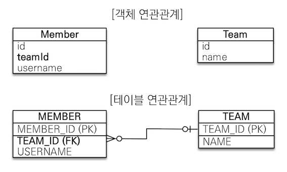

# 연관관계 매핑

연관관계 매핑이란 객체의 연관관계와 테이블의 연관관계를 매핑하는 것을 말한다.  

아래처럼 객체와 테이블 사이에는 연관관계의 차이가 존재한다.

- 객체 - 참조를 사용해서 연관된 객체를 찾음
- 테이블 - 외래 키로 조인을 사용해서 연관된 테이블을 찾음

그러므로, 단순히 객체를 테이블에 맞추어 모델링하면(데이터 중심), 객체들의 협력 관계를 만들수 없다.  

## 단방향 연관관계

단방향 연관관계에서 ```데이터 중심 모델링```과 ```객체 지향 모델링```의 차이를 살펴보자.  

### 데이터 중심 모델링



Team, Member는 연관관계가 없는 객체이다.  
객체 참조대신, 테이블의 FK를 객체에 그대로 사용했다.  

Member의 Team을 조회하는 코드입니다.

``` java
//Member 조회
Member findMember = em.find(Member.class, member.getId());

//Member의 Team조회
Long findTeamId = findMember.getTeamId();
Team findTeam = em.find(Team.class, findTeamId);
```

Member의 Team을 조회할 때, 식별자로 다시 조회해야 한다.  
즉, 객체 지향적인 방법이 아니다.

### 객체 지향 모델링


객체 연관관계를 사용했다.(Team을 포함관계로)  
또, 객체 참조와 테이블의 외래키를 매핑하여, 객체와 테이블의 연관관계를 매핑한다.(ORM 매핑)  

Member Entity를 살펴보자.  

``` java
@Entity
public class Member {

    @Id @GeneratedValue
    @Column(name = "MEMBER_ID")
    private Long id;

    @ManyToOne
    @JoinColumn(name = "TEAM_ID")
    private Team team;
```

```@ManyToOne```으로 Team과의 관계를 설정한다.  
```@JoinColumn```의 name 속성은 어떤 컬럼으로 Team table과 조인하는지를 지정한다.(객체의 참조와 테이블의 외래 키를 매핑한다.)  

Member의 Team을 조회하는 코드입니다.
``` java
//Member 조회
Member findMember = em.find(Member.class, member.getId());

//객체 참조를 통해서 연관관계 조회
Team findTeam = findMember.getTeam();
```
이전 데이터 중심의 모델링과 다르게 객체지향적으로 연관관계를 조회하는 것을 볼 수 있다.  

## 양방향 연관관계
양방향 연관관계에서 객체와 테이블의 연관관계를 맺는 차이로 인해 **양방향 매핑**이 필요하다.

### 연관관계의 주인과 mappedBy
### 객체와 테이블이 관계를 맺는 차이
#### 객체


객체의 양방향 관계는 단방향 관계 2개로 이뤄진다.  
즉, 객체를 양방향으로 참조하려면 단방향 연관관계를 2개 만들어야 한다.  

``` java
class Member {
    private Team team;
}

class Team {
    private Member member;
}
```

Member -> Team : member.getTeam()  
Team -> Member : team.getMember()

#### 테이블


테이블은 외래 키 하나로 두 테이블의 연관관계를 관리한다.  
즉, 외래 키 하나로 양방향 연관관계를 가질 수있다.  

아래의 SQL 문을 보면 양쪽으로 조인할 수 있는 것을 볼 수 있다.

``` sql
SELECT *
FROM MEMBER M
JOIN TEAM T
ON M.TEAM_ID = T.TEAM_ID

SELECT *
FROM TEAM T
JOIN MEMBER M
ON T.TEAM_ID = M.TEAM_ID
```

### 연관관계의 주인

위에서 객체와 테이블의 연관관계를 맺는 차이를 확인 할 수 있었다.  
이러한 차이에서 양방향 매핑을 하기위해 **연관관계의 주인**이 필요하다.(연관관계의 주인은 비지니스적으로 중요하다는 뜻이 아니다.)  
**연관관계의 주인은 table에서 외래키가 있는 곳으로 정하자.**

아래 클래스 다이어그램과 ERD를 통해 누구를 **연관관계의 주인**으로 정하는지 알아보자.


Member.team 또는 Team.members 중 연관관계의 주인을 정해야한다.


주인은 외래키가 있는 쪽을 주인으로 정하라(table에서 M인곳)
여기서는 Member.team이 연관관계의 주인
Team.members로 하면, 성능이슈도 있고, team의 값을 바꿧는데 member에 update되어 헷갈리수 있음

2. 연관관계의 주인이 외래 키를 관리한다.(등록, 수정) / 주인이 아닌쪽은 읽기만 가능
3. 주인이 아닌쪽에 mappedBy을 사용하여, 속성으로 주인을 지정(해석하면 저거에 의해서 mapping 되었다)
