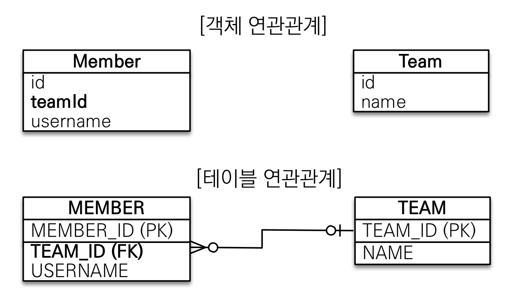
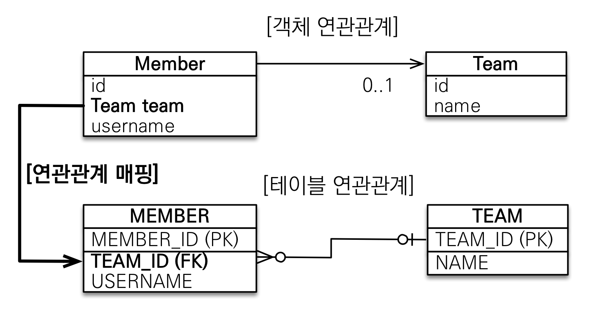

# 연관관계 매핑
연관관계 매핑이란 객체의 연관관계와 테이블의 연관관계를 매핑하는 것을 말한다.  

아래처럼 객체와 테이블 사이에는 연관관계의 차이가 존재한다.

- 객체 - 참조를 사용해서 연관된 객체를 찾음
- 테이블 - 외래 키로 조인을 사용해서 연관된 테이블을 찾음

그러므로, 단순히 객체를 테이블에 맞추어 모델링하면(데이터 중심), 객체들의 협력 관계를 만들수 없다.  

## 단방향 연관관계

단방향 연관관계에서 ```데이터 중심 모델링```과 ```객체 지향 모델링```의 차이를 살펴보자.  

### 데이터 중심 모델링



Team, Member는 연관관계가 없는 객체이다.  
객체 참조대신, 테이블의 FK를 객체에 그대로 사용했다.  

Member의 Team을 조회하는 코드입니다.

``` java
//Member 조회
Member findMember = em.find(Member.class, member.getId());

//Member의 Team조회
Long findTeamId = findMember.getTeamId();
Team findTeam = em.find(Team.class, findTeamId);
```

Member의 Team을 조회할 때, 식별자로 다시 조회해야 한다.  
즉, 객체 지향적인 방법이 아니다.

### 객체 지향 모델링



객체 연관관계를 사용했다.(Team을 포함관계로)  
또, 객체 참조와 테이블의 외래키를 매핑하여, 객체와 테이블의 연관관계를 매핑하였다.(ORM 매핑)  

Member Entity를 살펴보자.  

``` java
@Entity
public class Member {

    @Id @GeneratedValue
    @Column(name = "MEMBER_ID")
    private Long id;

    @ManyToOne
    @JoinColumn(name = "TEAM_ID")
    private Team team;
```

```@ManyToOne```으로 Team과의 관계를 설정한다.  
```@JoinColumn```의 name 속성은 어떤 컬럼으로 Team table과 조인하는지를 지정한다.(객체의 참조와 테이블의 외래 키를 매핑한다.)  

Member의 Team을 조회하는 코드입니다.
``` java
//Member 조회
Member findMember = em.find(Member.class, member.getId());

//객체 참조를 통해서 연관관계 조회
Team findTeam = findMember.getTeam();
```
이전 데이터 중심의 모델링과 다르게 객체지향적으로 연관관계를 조회하는 것을 볼 수 있다.  