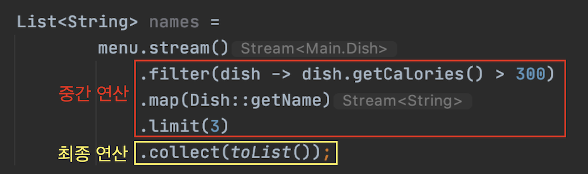

# 스트림이란?
스트림이란 데이터 처리 연산을 지원하도록 소스에서 추출된 연속된 요소(Sequence of elements)이다.  
- 연속된 요소  
컬렉션과 마찬가지로 스트림은 특정 요소 형식으로 이루어진 연속된 값 집합의 인터페이스를 제공한다. 컬렉션은 자료구조이므로 시간과 공간의 복잡성과 관련된 요소 저장 및 접근 연산이 주를 이루고, 스트림은 filter, sorted, map처럼 표현 계산식이 주를 이룬다.  
컬렉션의 주제는 데이터이고, 스트림의 주제는 계산이다.
- 소스  
스트림은 컬렉션, 배열, I/O 자원 등의 데이터 제공 소스로부터 데이터를 소비한다. 정렬된 컬렉션으로 스트림을 생성하면 정렬이 그대로 유지된다.
- 데이터 처리 연산  
함수형 프로그래밍 언어에서 일반적으로 지원하는 연산과 데이터베이스와 비슷한 연산을 지원한다. 스트림 연산은 순차적으로 또는 병렬로 실행할 수 있다.
<br/>

## 장점
스트림을 이용하면 선언형으로 컬렉션 데이터를 처리할 수 있어, **간결하고 가독성이 좋아진다.**(구현 코드 대신 질의로 표현)  
filter, sorted, map, collect 같은 스트림 연산을 연결해서 **복잡한 데이터 처리 파이프라인을 만들수 있어 유연성이 좋아진다.**  또, **멀티스레드 코드를 구현하지 않아도 데이터를 투명하게 병렬로 처리할 수 있고, 성능이 좋아진다.**

다음은 저칼로리의 요리명을 반환하고, 칼로리를 기준으로 요리를 정렬하고, 저칼로리의 요리명을 반환하는 예제로  
자바 7과 stream이 있는 자바 8을 비교해보자.

``` java
List<Dish> lowCaloricDishes = new ArrayList<>();
for (Dish dish : menu) {
    if (dish.getCalories() < 400) {
        lowCaloricDishes.add(dish);
    }
}

Collections.sort(lowCaloricDishes, new Comparator<Dish>() {
    @Override
    public int compare(Dish dish1, Dish dish2) {
        return Integer.compare(dish1.getCalories(), dish2.getCalories());
    }
});

List<String> lowCaloricDishesName = new ArrayList<>();
for (Dish dish : lowCaloricDishes) {
    lowCaloricDishesName.add(dish.getName());
}
```

lowCaloricDishes는 컨테이너 역할만 하는 가비지 변수이다. 자바 8에서는 이러한 구현들을 라이브러리 내에서 처리한다.

``` java
List<String> lowCaloricDishesName =
        menu.stream()
            .filter(d -> d.getCalories() < 400)
            .sorted(comparing(Dish::getCalories))
            .map(Dish::getName)
            .collect(toList());`
```

자바 8의 stream을 이용해서 간결하게 구현된 것을 볼 수 있다. ```stream``` 대신 ```parallelStream```을 사용해서 멀티코어 아키텍처에서 병렬로 실행할 수 있다. filter, sorted, map, collect 같은 연산은 고수준 빌딩 블록으로 이루어져 있어 특정 스레딩 모델에 제한되지 않고 자유롭게 사용할 수 있다. 우리는 데이터 처리 과정을 병렬화하면서 스레드와 락을 걱정할 필요가 없다.

스트림의 주요특징은 아래와 같다.
- 파이프라이닝(Pipelining)  
대부분의 스트림 연산은 스트림 연산끼리 연결해서 커다란 파이프라인을 구성할 수 있도록 스트림 자신을 반환한다.  
그래서 laziness, short-circuiting 같은 최적화를 얻을 수 있다.
- 내부 반복  
반복자를 이용해서 명시적으로 반복하는 컬렉션과 달리 스트림은 내부 반복을 지원한다.

예제를 통해서 알아보자.  

``` java
List<String> threeHighCaloricDishNames =
        menu.stream()
            .filter(dish -> dish.getCalories() > 300)
            .map(Dish::getName)
            .limit(3)
            .collect(toList());
```

데이터 소스는 요리 리스트이고, 연속된 요소를 스트림에 제공한다. filter, map, limit, collect는 이련의 데이터 처리 연산을 적용한다. collect로 파이프라인 처리결과를 반환한다.  

각각의 메서드가 어떤 역할을 하는지 알아보자
- filter(필터링) : 스트림에서 특정 요소를 제외시킨다.
- map(추출) : 한 요소를 다른 요소로 변환하거나 정보를 추출한다.
- limit(축소) : 정해진 개수 이상의 요소가 스트림에 저장되지 못하게 스트림 크기를 축소한다.
- collect : 스트림을 다른 형식으로 변환한다.(toList()는 리스트로 변환)
<br/>

## 스트림과 컬렉션의 차이
기존 컬렉션과 새로운 스트림 모두 연속된 element type의 값을 저장하는 자료구조의 인터페이스를 제공한다.  
이제 컬렉션과 스트림의 차이점에 대해 알아보자.

### 1. 데이터 계산 시점
데이터를 언제 계산하느냐가 가장 큰 차이다. **컬렉션**은 현재 자료구조가 포함하는 모든 값을 메모리에 저장하는 자료구조다.  
컬렉션의 모든 요소는 컬렉션에 추가되기 전에 계산되어야 한다.(요소를 추가하거나 제거할 수 있다.)  

반면 **스트림**은 이론적으로 요청할 때만 요소를 계산하는 고정된 자료구조다. (요소를 추가하거나 제거할 수 없다.) 이러한 특성은 프로그래밍에 큰 도움을 준다. 

예를 들어 무한 소수를 포함하는 스트림을 간단하게 만들 수 있다. 사용자가 요청하는 값만 스트림에서 추출한다는 것이 핵심이다. 스트림은 lazy하게 만들어지는 컬렉션과 같다. 컬렉션은 모든 무한 소수를 포함하려 할 것이므로 무한 루프를 돌면서 계산하고 추가하기를 반복할 것이다. 결국 소비자는 영원히 결과를 볼 수 없다.

### 2. 딱 한 번만 탐색할 수 있다.
Iterator와 마찬가지로 스트림도 한번만 탐색할 수 있다. 탐색된 스트림의 element는 소비된다. 다시 탐색하려면 초기 데이터 소스에서 새로운 스트림을 만들어야 한다.

```java
Stream<String> s = items.stream();
s.forEach(System.out::println);//item 출력
s.forEach(System.out::println);//스트림이 이미 소비되었거나 닫힘(IllegalStateException 발생)
```

### 3. 외부 반복과 내부 반복
컬렉션 인터페이슬르 사용하려면 사용자가 직접 element를 반복해야 한다. 이를 **외부 반복**이라고 한다. 스트림 라이브러리는 **내부 반복**을 사용한다. 어떤 작업을 수행할지만 지정하면 모든 것이 알아서 처리된다. 반복을 알아서 처리하고 결과 스트림값을 어딘가에 저장한다.  

내부 반복을 이용의 장점은 **작업을 투명하게 병렬 처리**할 수 있고, **작업을 더 최적화된 다양한 순서로 처리**할 수 있다.  
외부 반복을 이용하면 병렬성을 직접 관리해야하고, 최적화하기 쉽지 않다.

for-each 구문을 이용한 외부 반복이다. Iterator를 사용하는 불편함을 어느 정도는 해결해준다.

```java
List<String> names = new ArrayList<>();
for(Dish dish : menu) {
    names.add(dish.getName());
}
```

스트림을 이용한 내부 반복이다. 직접 반복할 필요가 없어졌다.

```java
List<String> names = menu.stream()
                    .map(Dish::getName)
                    .collect(toList());
```
<br/>

## 스트림 연산
스트림 인터페이스의 연산은 **중간 연산**과 **최종 연산**으로 구분할 수 있다.



### 중간 연산(intermediate operation)
중간 연산은 다른 스트림을 반환한다. 여러 중간 연산을 연결해서 질의를 만들 수 있다. 중요한 특징은 lazy하다는 것이다.  
최종 연산을 스트림 파이프라인에 실행하기 전까지는 아무 연산도 수행하지 않는다는 것이다.  
중간 연산을 합친 다음 합쳐진 중간 연산을 최종 연산으로 한번에 처리한다.

> ##### lazy로 인한 최적화 효과를 얻을 수 있다. 
##### - 300칼로리가 넘는 것이 3개가 넘지만 3개만 선택된 이유는 limit과 쇼트서킷이라는 기법 덕분이다. 
##### - filter와 map이 다른 연산이지만 한과정으로 병합되었다.(루프 퓨전 기법)

### 최종 연산(terminal operation)
최종 연산은 스트림 파이프라인에서 결과를 도출한다. 스트림 이외의 결과가 반환된다.(List, Integer, void 등)  

### 연산 정리
#### 1. 중간 연산
|연산|반환 형식|연산의 인수|함수 디스크립터|
|--|---|---|---|
|filter|Stream\<T>|Predicate\<T>|T -> boolean|
|map|Stream\<R>|Function<T, R>|T -> R|
|limit|Stream\<T>|
|sorted|Stream\<T>|Comparator\<T>|(T, T) -> int|
|distinct|Stream\<T>|

#### 2. 최종 연산
|연산|반환 형식|목적|
|--|---|------|
|forEach|void|스트림의 각 요소를 소비하면서 람다를 적용한다.|
|count|long(generic)|스트림의 요소 개수를 반환한다.|
|collect||스트림을 리듀스해서 리스트, 맵, 정수 형식의 컬렉션을 만든다.|
